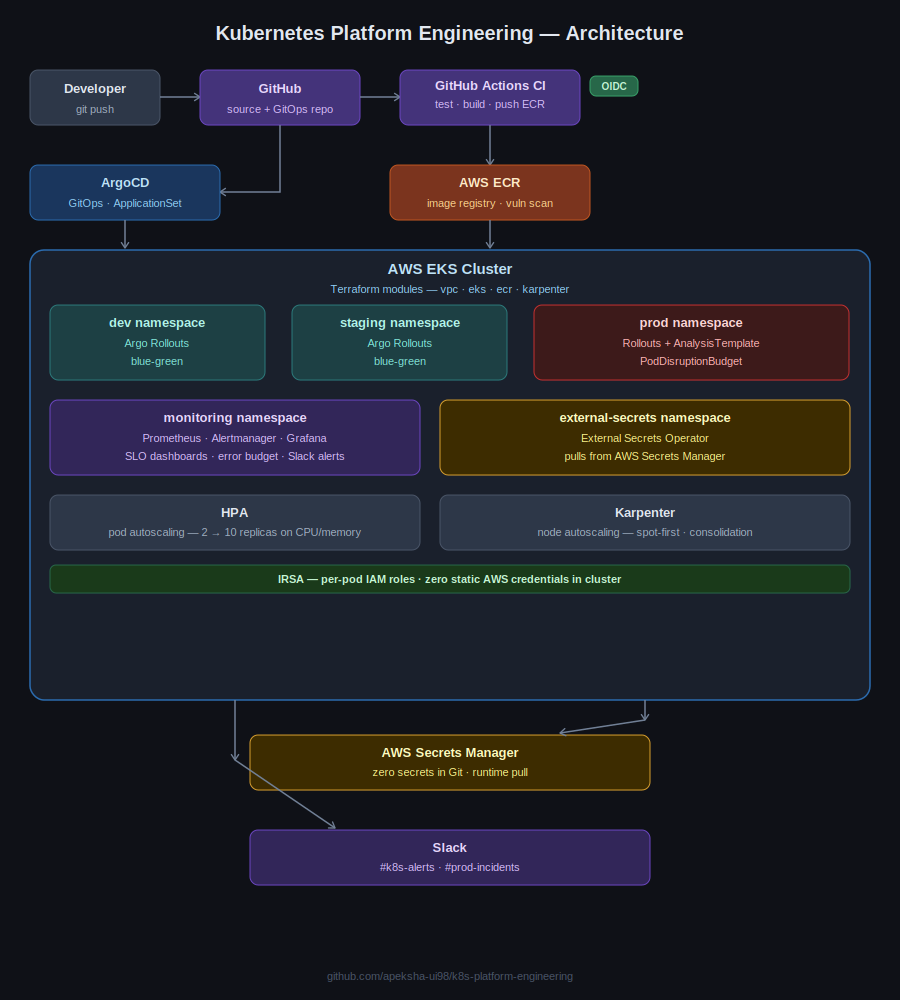
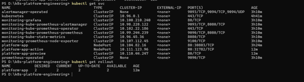

# ☸️ Kubernetes Platform Engineering

> **Enterprise-grade Kubernetes platform on AWS EKS** — Terraform Modules · ArgoCD GitOps · Argo Rollouts · IRSA · External Secrets · HPA · Karpenter · Prometheus · Grafana · GitHub Actions


---

## 📐 Architecture



Developer pushes code to GitHub
         │
         ▼
GitHub Actions (CI)
  ├── Run pytest tests
  ├── Build Docker image
  ├── Push to AWS ECR (OIDC — no static credentials)
  └── Update image tag in GitOps repo
         │
         ▼
ArgoCD (GitOps controller)
  └── Watches GitOps repo → syncs to EKS
         │
         ▼
EKS Cluster (provisioned by Terraform modules)
  ├── dev namespace        → Argo Rollouts (automated blue-green)
  ├── staging namespace    → Argo Rollouts (automated blue-green)
  ├── prod namespace       → Argo Rollouts + AnalysisTemplate + PDB
  ├── monitoring namespace → Prometheus · Alertmanager · Grafana (SLO dashboards)
  └── external-secrets ns  → External Secrets Operator (AWS Secrets Manager)

Karpenter   → auto-provisions EC2 nodes (spot-first) when pods are pending
HPA         → auto-scales pod replicas based on CPU/memory
IRSA        → per-pod IAM roles, zero static AWS keys in cluster
```

---

## 🧰 Tech Stack

| Layer | Technology | Why chosen |
|---|---|---|
| **Cloud** | AWS EKS | Managed Kubernetes; native IAM/ECR integration |
| **IaC** | Terraform Modules (vpc · eks · ecr · karpenter) | Reusable, versioned — senior-engineer pattern |
| **Container Registry** | AWS ECR | IAM-based auth, vulnerability scanning, no credentials |
| **GitOps** | ArgoCD + ApplicationSet | One manifest generates dev/staging/prod apps automatically |
| **Progressive Delivery** | Argo Rollouts (blue-green) | Automated health analysis; auto-rollback on failure |
| **Secret Management** | External Secrets + AWS Secrets Manager | Zero secrets in Git — zero-trust model |
| **AWS Pod Permissions** | IRSA (IAM Roles for Service Accounts) | Least-privilege per pod, no cluster-wide IAM role |
| **Node Autoscaling** | Karpenter | Faster + cheaper than Cluster Autoscaler; spot-instance native |
| **Pod Autoscaling** | HPA (CPU + memory) | Scales replicas 2→10 automatically under load |
| **Observability** | Prometheus · Grafana · Alertmanager | SLO dashboards, error budgets, Slack alerts |
| **CI/CD** | GitHub Actions + OIDC | Passwordless AWS auth; only this repo can assume the role |

---

## 📁 Project Structure

```
k8s-platform-engineering/
├── app/                          # Python Flask application + Dockerfile
│   ├── app.py
│   ├── requirements.txt
│   └── Dockerfile
├── terraform/
│   ├── modules/
│   │   ├── vpc/                  # Reusable VPC module (subnets, NAT, tags)
│   │   ├── eks/                  # EKS cluster + managed node groups + IRSA
│   │   ├── ecr/                  # Container registry + lifecycle policy
│   │   └── karpenter/            # Karpenter install + NodePool + EC2NodeClass
│   └── environments/
│       ├── dev/                  # Calls modules with dev-specific values
│       └── prod/                 # Calls same modules with prod values
├── helm/platform-app/            # Helm chart (Rollout · Service · HPA · Analysis)
├── gitops/
│   ├── base/                     # Shared manifests (rollout, service, external-secrets)
│   ├── overlays/
│   │   ├── dev/                  # Kustomize patch: replicas=1, smaller resources
│   │   ├── staging/              # Kustomize patch: replicas=2
│   │   └── prod/                 # Kustomize patch: replicas=3, PDB, larger resources
│   └── applicationset.yaml       # One ArgoCD ApplicationSet → 3 environments
├── monitoring/
│   ├── alertmanager-config.yaml  # Slack routing (dev channel + prod-incidents channel)
│   └── slo-rules.yaml            # PrometheusRules: availability SLO + error budget
└── .github/workflows/
    └── ci-cd.yml                 # Test → Build → Push ECR → Update GitOps tag
```

---

## ✨ Key Features

### 1. Reusable Terraform Modules
Rather than a single monolithic `main.tf`, the infrastructure is broken into composable modules — `vpc`, `eks`, `ecr`, and `karpenter`. Dev and prod environments call the same modules with different variables, reducing duplication and showing the reusable IaC pattern senior engineers are expected to produce.

### 2. Zero Static Credentials — IRSA + GitHub OIDC
- **IRSA** gives each Kubernetes service account (External Secrets, Karpenter, AWS Load Balancer Controller) its own scoped IAM role. No cluster-wide IAM role, no static keys mounted as secrets.
- **GitHub OIDC** lets CI/CD authenticate to AWS with a temporary token. No `AWS_ACCESS_KEY_ID` stored in GitHub Secrets — only this repository can assume the role.

### 3. Automated Blue-Green with Argo Rollouts
Deployments use `kind: Rollout` instead of `kind: Deployment`. The blue-green strategy:
- Spins up the new (green) version in the preview service
- Runs a Prometheus `AnalysisTemplate` — requires ≥95% success rate over 5 checks
- Auto-promotes on pass, auto-rollbacks on failure
- Scales down old (blue) pods 5 minutes after promotion

### 4. Multi-Environment GitOps with ApplicationSet
A single `ApplicationSet` manifest generates three ArgoCD Applications (dev / staging / prod) from a list generator. Kustomize overlays per environment control replica count, resource limits, and PodDisruptionBudgets. Pushing to `main` auto-deploys to dev; staging and prod require manual promotion in the ArgoCD UI.

### 5. Zero Secrets in Git — External Secrets Operator
All application secrets (DB passwords, API keys, JWT secrets) live in AWS Secrets Manager. The External Secrets Operator pulls them at runtime and creates standard Kubernetes Secrets transparently. No sensitive values ever touch a YAML file or Git commit.

### 6. SRE-Grade Observability
- **Availability SLO**: 99.5% of requests must return 2xx. Alert fires within 2 minutes of breach.
- **Error budget**: Grafana gauge shows remaining budget (green → yellow → red).
- **Alertmanager**: dev alerts → `#k8s-platform-alerts` Slack; prod alerts → `#prod-incidents` with 🔥 prefix.
- **Karpenter consolidation**: underutilized nodes drained and terminated automatically after 30 seconds.

---

## 📸 Screenshots


## 🚀 How to Run

### Prerequisites
- AWS CLI configured (`ap-south-1`)
- Terraform ≥ 1.5
- kubectl, Helm 3, ArgoCD CLI

### 1 — Provision infrastructure
```bash
cd terraform/environments/dev
terraform init
terraform apply -auto-approve
```

### 2 — Install ArgoCD
```bash
kubectl create namespace argocd
kubectl apply -n argocd -f https://raw.githubusercontent.com/argoproj/argo-rollouts/stable/manifests/install.yaml
```

### 3 — Deploy ApplicationSet (all 3 environments)
```bash
kubectl apply -f gitops/applicationset.yaml
```

### 4 — Install monitoring stack
```bash
helm repo add prometheus-community https://prometheus-community.github.io/helm-charts
helm install monitoring prometheus-community/kube-prometheus-stack \
  --namespace monitoring --create-namespace
kubectl apply -f monitoring/slo-rules.yaml
kubectl apply -f monitoring/alertmanager-config.yaml
```

### 5 — Trigger a blue-green rollout
```bash
# Update image tag → ArgoCD detects the GitOps commit → Argo Rollouts promotes
kubectl argo rollouts get rollout platform-app -n dev --watch
kubectl argo rollouts promote platform-app -n dev
```

### Local Minikube (no AWS required)
```bash
minikube start --cpus=4 --memory=8g
helm install platform-app ./helm/platform-app --namespace dev --create-namespace
kubectl port-forward svc/platform-app 5000:5000 -n dev
```

---

## 💡 Technical Decisions

| Decision | Chosen | Why not the alternative |
|---|---|---|
| Node autoscaler | Karpenter | Cluster Autoscaler is slower and doesn't consolidate; Karpenter provisions in ~30s and terminates underutilised nodes automatically |
| Secret management | External Secrets + Secrets Manager | Kubernetes Secrets are only base64 — anyone with kubectl access can read them |
| Pod AWS auth | IRSA | Node-level IAM roles give all pods the same permissions — IRSA scopes per service account |
| Blue-green controller | Argo Rollouts | `kubectl patch` is manual and has no health gate; Rollouts automates analysis and rollback |
| CI AWS auth | GitHub OIDC | Static `AWS_ACCESS_KEY_ID` in secrets is a rotation burden and a leak risk |

---

## 📊 Cost Notes

- Dev environment: single NAT gateway, spot instances via Karpenter → ~$3–5/day
- Karpenter consolidation (`consolidateAfter: 30s`) reduces idle node cost by ~60%
- ECR lifecycle policy retains only last 10 images → minimal storage cost
- **Always run `terraform destroy` when done** — EKS control plane alone costs ~$0.10/hour

---

## 🏆 Resume Bullets

```
Kubernetes Platform Engineering | EKS · Terraform Modules · ArgoCD · Argo Rollouts · IRSA · Karpenter · HPA · External Secrets · Prometheus · Grafana · GitHub Actions
github.com/apeksha-ui98/k8s-platform-engineering

• Provisioned multi-environment EKS platform using reusable Terraform modules (vpc, eks, ecr, karpenter)
  with IRSA for least-privilege pod-level IAM — zero static AWS credentials in cluster

• Implemented automated blue-green deployments with Argo Rollouts and Prometheus AnalysisTemplate —
  promotion requires 95% success rate over 5 checks; failed analysis triggers automatic rollback

• Built multi-environment GitOps pipeline (dev/staging/prod) using ArgoCD ApplicationSet — Git push
  auto-deploys to dev, staging and prod require manual promotion in ArgoCD UI

• Deployed External Secrets Operator with AWS Secrets Manager — all secrets pulled at runtime,
  zero secrets stored in Git or Kubernetes Secret manifests

• Configured SRE-grade observability with 99.5% availability SLO, error budget dashboard in Grafana,
  and Alertmanager routing prod incidents to dedicated Slack channel with automated breach alerts

• Integrated Karpenter (spot-first) + HPA — cluster scales 2→10 nodes automatically;
  Karpenter consolidation reduces node cost by up to 60%

• Eliminated static AWS credentials in CI/CD using GitHub Actions OIDC — scoped IAM role allows
  only this repository to authenticate; images pushed to ECR with vulnerability scanning enabled
```

---

## 👤 Author

**Apeksha Laad** — DevOps Engineer  
[GitHub](https://github.com/apeksha-ui98) · [LinkedIn](https://linkedin.com/in/apeksha-laad-89844a1a2) · apekshaalaad@gmail.com
